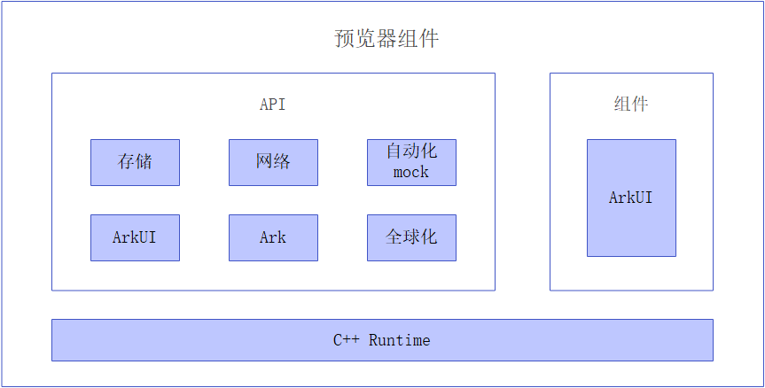

# 预览器组件<a name="ZH-CN_TOPIC_0000001076213355"></a>

-   [简介](#section15701932113019)
-   [目录](#section1791423143211)
-   [使用场景](#section171384529150)
-   [相关仓](#section1447164910172)

## 简介<a name="section15701932113019"></a>

通过调用ArkUI框架接口，实现页面预览功能。支持在Windows、Linux、MacOS上运行ArkTS及JS应用，并输出页面预览图片。

**图 1**  预览器组件结构<a name="fig2606133765017"></a>  



## 目录<a name="section1791423143211"></a>

预览器组件源代码在/tools_previewer下，目录结构如下图所示：

```
/tools_previewer
├── cli                       # 命令处理
├── gn                        # 编译依赖及工具链配置
├── jsapp                     # 渲染引擎调用
├── mock                      # 交互层代码
├── util                      # 工具类
```

## 使用场景<a name="section171384529150"></a>

预览器组件为DevEco Studio预览器提供了调用ArkUI渲染页面的能力。

## 相关仓<a name="section1447164910172"></a>

**tools_previewer**

[arkui\_ace\_engine\_lite](https://gitee.com/openharmony/arkui_ace_engine_lite)

[arkui\_ace\_engine](https://gitee.com/openharmony/arkui_ace_engine)

